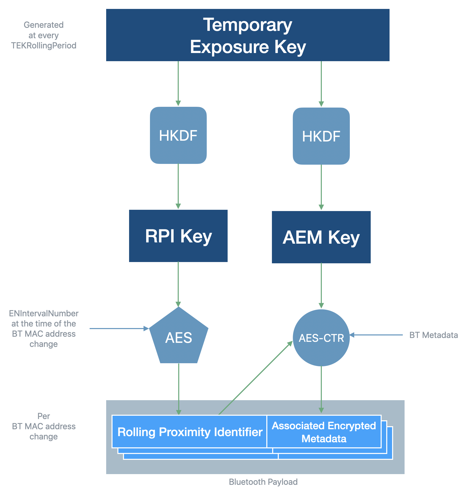

# Exposure Notifications Cryptography

This document contains snippets code from the sample, occasionally in pseudocode, for the
implementation the cryptographic specifications defined by the [Exposure Notification Cryptography
Specification](https://blog.google/documents/69/Exposure_Notification_-_Cryptography_Specification_v1.2.1.pdf).

Many of the snippets included in this document have been simplified from their actual
implementation. Constants, select parameters, and member variables have been inlined for brevity.
The actual implementation can be seen by inspecting the classes referenced.

Because this document follows the ordering of the specification, it is advisable to read them
together.

## Cryptographic Overview

The following chart  may be helpful for better understanding how the various parts of the system
fit together.



## ENIntervalNumber

This function provides a number for each 10 minute time window that’s shared between all devices
participating in the protocol. These time windows are derived from timestamps in Unix Epoch Time.

```java
private static int getCurrentEnIntervalNumber(Instant instant) {
    return (int) (instant.toEpochMilli() / MINUTES.toMillis(10));
}
```

`ENIntervalNumber` is part of
`com.google.samples.exposurenotification.ble.advertising.RollingProximityIdManager`.

## TEKRollingPeriod

The TEKRollingPeriod is the duration for which a Temporary Exposure Key is valid (in multiples of 10
minutes). In our current implementation, the TEKRollingPeriod is  144, achieving a key validity of 24 hours. 

The rolling period is part of the class
`com.google.samples.exposurenotification.TemporaryExposureKey` and is set by the
`TemporaryExposureKey.Builder#setRollingPeriod` method.

## Temporary Exposure Key

Temporary Exposure Keys (TEK) are not created explicitly, but implicitly as required. This happens due to one of two reasons:

1. This is the very first TEK being generated
2. The current TEK has expired

This check is performed by first calling `RollingProximityIdManager#getExistingKey`. If this call returns `null` then a new key is generated.

If a TEK is returned, the code compares the current rolling period with the last valid rolling period for the key. If that check indicates the key has expired (the current period is greater than the last rolling period), a new TEK is generated.

Pseudocode of for this check follows:

```java
var temporaryExposureKey = getCurrentTEK();
if (temporaryExposureKey == null ||
    currentEnIntervalNumber > temporaryExposureKey.getlastValidRollingPeriod()) {
    temporaryExposureKey = TemporaryExposureKeyGenerator.generateKey();
}
```

The implementation of of `getCurrentTEK()` is provided by `RollingProximityIdManager#getExistingKey` and the value of `currentEnIntervalNumber` is calculated by the function `RollingProximityIdManager#getCurrentEnIntervalNumber`.

The key data is generated from a cryptographic random number generator so there is no link between TEKs. The method is in
`com.google.samples.exposurenotification.data.generator.TemporaryExposureKeyGenerator`

```java
public static TemporaryExposureKey generateKey(
        int rollingStartIntervalNumber, int rollingPeriod) {
    SecureRandom random = new SecureRandom();
    byte[] key = new byte[16];
    random.nextBytes(key);
    // ...
}
```

## Rolling Proximity Identifier Key

The Rolling Proximity Identifier Key (RPIK) is derived from the Temporary Exposure Key and is
used in order to derive the Rolling Proximity Identifiers.

The key is generated in
`com.google.samples.exposurenotification.crypto.KeyDerivation` via
`com.google.samples.exposurenotification.data.generator.RollingProximityIdGeneratorBase#generateRpiKey`.

```java
static byte[] generateRpiKey(byte[] temporaryExposureKey) {
    // RPIK = HKDF(tek, NULL, UTF8("EN-RPIK"), 16).
    return KeyDerivation.hkdfSha256(
            temporaryExposureKey,
            /* inputSalt =*/ null,
            "EN-RPIK".getBytes(UTF_8),
            16);
}
```

```java
public static byte[] hkdfSha256(
        Mac mac, byte[] inputKeyingMaterial,
        @Nullable byte[] inputSalt,
        byte[] info,
        int length) throws CryptoException {

    byte[] salt = (inputSalt == null || inputSalt.length == 0) ? new byte[HASH_LENGTH] : inputSalt;
    try {
        mac = Mac.getInstance("HmacSHA256");
        return hkdfSha256ExpandLength16(mac, hkdfSha256Extract(mac, inputKeyingMaterial, salt), info);
    } catch (InvalidKeyException e) {
        throw new CryptoException(e);
    }
}
```

The method `hkdfSha256ExpandLength16` is implemented in the same class:

```java
private static byte[] hkdfSha256ExpandLength16(Mac mac, byte[] pseudoRandomKey, byte[] info)
        throws InvalidKeyException {
    // For length being 16 cases, counter always equals to 0x01.
    byte[] counter = {0x01};
    mac.init(new SecretKeySpec(pseudoRandomKey, ALGORITHM_NAME));
    mac.update(info);

    return Arrays.copyOf(mac.doFinal(counter), HKDF_OUTPUT_LENGTH);
}
```

## Rolling Proximity Identifier

Rolling Proximity Identifiers (RPIs) are short-lived identifiers (on average 15 minutes) that are broadcast in
Bluetooth payloads. The RPIs are generated every 10 minutes, and, because of how Android
BLE advertising works, each time it's started the system will also generate a new random BLE MAC address.

The code to generate an RPI begins in 
`com.google.samples.exposurenotification.data.generator.RollingProximityIdGeneratorBase` in the
method `generateId`:

```java
public RollingProximityId generateId(int intervalNumber) throws CryptoException {
    return new RollingProximityId(
            encryptor.encrypt(generatePaddedData(intervalNumber, "EN-RPI")));
}
```

`generatePaddedData` creates a `ByteBuffer` and calls through to the method `addPaddedData`:

```java
private static ByteBuffer addPaddedData(int intervalNumber, byte[] aesPadding) {
    // AES_BLOCK_SIZE = 16 (bytes)
    ByteBuffer buffer = ByteBuffer.allocate(AES_BLOCK_SIZE).order(ByteOrder.LITTLE_ENDIAN);
    buffer
            .put(aesPadding)
            .position(buffer.position() + AES_BLOCK_SIZE - aesPadding.length - Integer.BYTES);
    buffer.putInt(intervalNumber);
    return buffer;
}
```

The encryption (to generate a new RPI from a TEK seed) is done by the class
`com.google.samples.exposurenotification.crypto.AesEcbEncryptor` in the method `encrypt`:

```java
public byte[] encrypt(byte[] data) throws CryptoException {
    try {
        Cipher cipher = new AesEcbEncryptor(Cipher.getInstance("AES/ECB/NoPadding"));
        return cipher.doFinal(data);
    } catch (BadPaddingException | IllegalBlockSizeException e) {
        throw new CryptoException(e);
    }
}
```

## Associated Encrypted Metadata Key

The Associated Encrypted Metadata Keys are derived from the Temporary Exposure Keys in order to
encrypt additional metadata.

The key is generated by the class
`com.google.samples.exposurenotification.data.generator.AssociatedEncryptedMetadataHelper`:

```java
public static byte[] generateAemKey(byte[] temporaryExposureKey) {
    // AEMK = HKDF(tek, NULL, UTF8("EN-AEMK"), 16).
    return KeyDerivation.hkdfSha256(
            temporaryExposureKey,
            /* inputSalt =*/ null,
            "EN-AEMK".getBytes(UTF_8),
            16);
}
```

The method `KeyDerivation.hkdfSha256` is the same function used above to generate the [Rolling
Proximity Identifier Key](#Rolling-Proximity-Identifier-Key).

## Associated Encrypted Metadata

The Associated Encrypted Metadata is data encrypted along with the Rolling Proximity Identifier,
and can only be decrypted later if the user broadcasting it tested positive and reveals their
Temporary Exposure Key.

The details of the metadata itself is described in the Advertising Payload section of the
[Bluetooth Specification](https://blog.google/documents/70/Exposure_Notification_-_Bluetooth_Specification_v1.2.2.pdf).

The encryption is performed by the class
`com.google.samples.exposurenotification.data.generator.AssociatedEncryptedMetadataHelper`

```java
public static byte[] encryptOrDecrypt(
        byte[] aemKey, byte[] rollingProximityId, byte[] bluetoothMetadataAsBytes)
        throws CryptoException {
    return AesCtrEncryptor.aesCtr(aemKey, rollingProximityId, bluetoothMetadataAsBytes);
}
```

The encryption of the metadata itself is AES-128 block cipher in Counter Mode with the rolling
proximity ID as the IV. 

```java
public static byte[] aesCtr(byte[] key, byte[] iv, byte[] data) throws CryptoException {
    try {
        Cipher cipher = Cipher.getInstance("AES/CTR/NoPadding");
        cipher.init(Cipher.ENCRYPT_MODE, new SecretKeySpec(key, "AES"), new IvParameterSpec(iv));

        return cipher.doFinal(data);
    } catch (NoSuchPaddingException
            | NoSuchAlgorithmException
            | InvalidAlgorithmParameterException
            | InvalidKeyException
            | BadPaddingException
            | IllegalBlockSizeException e) {
        throw new CryptoException(e);
    }
}
```
